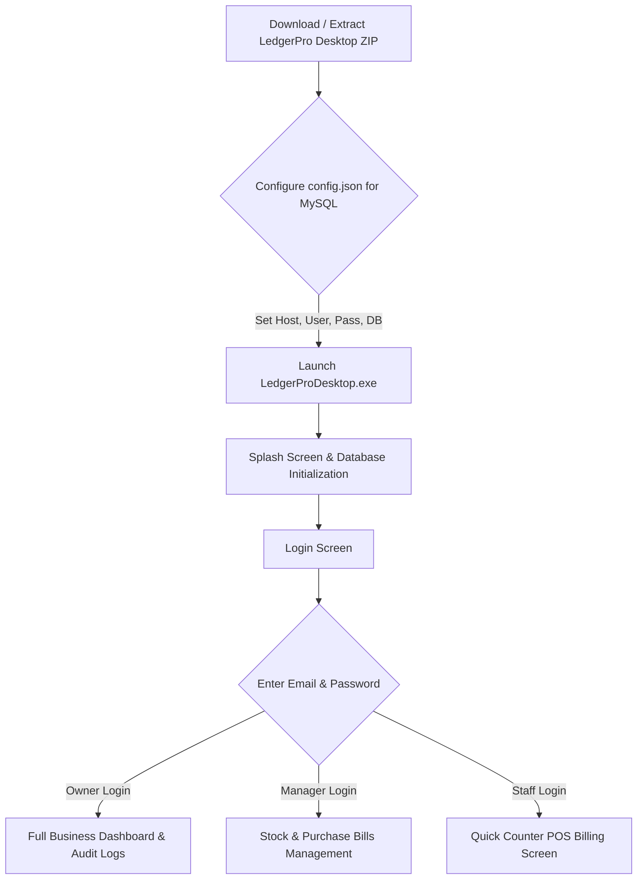
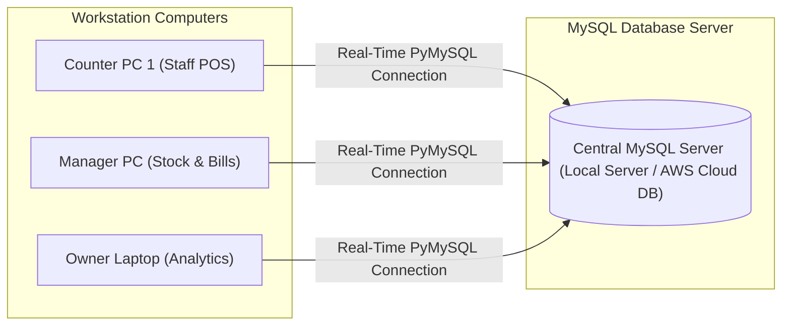
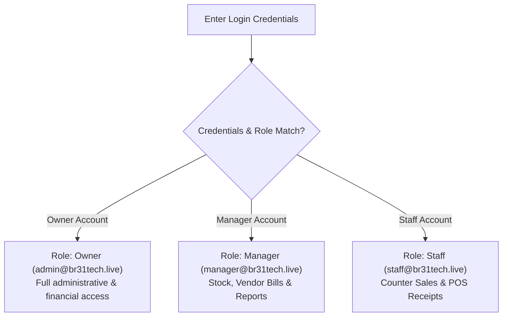

# 📘 LedgerPro Desktop - Client Installation & Configuration Guide (MySQL Edition)

Welcome to **LedgerPro Desktop**! This guide will walk you through installing, configuring, and running the application on Windows computers using a centralized **MySQL Database**.

---

## 🗺️ Client Installation & Setup Flow



---

## 🖥️ Multi-User Network Architecture

LedgerPro Desktop allows multiple computers (Workstations, POS Counters, Manager Desktops) across your office network or over the internet to connect simultaneously to a single centralized MySQL Database server.



---

## 1. System Requirements

- **Operating System:** Windows 10 or Windows 11 (64-bit)
- **Memory (RAM):** 4 GB minimum (8 GB recommended)
- **Disk Space:** 250 MB free disk space
- **Network:** Local Area Network (LAN) OR Internet connection to MySQL Server
- **Database Engine:** **MySQL 8.0+** (Localhost server or Remote Cloud MySQL)

---

## 2. Installation Steps

LedgerPro Desktop is delivered as a ready-to-run desktop application.

1. **Extract the Package:**
   Extract `LedgerProDesktop.zip` into your preferred folder (e.g., `C:\LedgerProDesktop`).

2. **Configure Database Connection (`config.json`):**
   Open `config.json` in Notepad located inside the extracted folder:
   ```json
   {
       "database": {
           "type": "mysql",
           "host": "YOUR_MYSQL_HOST_IP_OR_DOMAIN",
           "port": 3306,
           "user": "root",
           "password": "YOUR_MYSQL_PASSWORD",
           "database": "ledgerpro"
       }
   }
   ```
   *(Replace `YOUR_MYSQL_HOST_IP_OR_DOMAIN` with `localhost` for local server, or your server's IP address if using remote MySQL).*

3. **Launch the Application:**
   Double-click `LedgerProDesktop.exe` (or run `python main.py` in development mode).
   - *Tip:* Right-click `LedgerProDesktop.exe` and click **Send to > Desktop (create shortcut)**.

---

## 3. Initial Login & Multi-Role Setup

When the login window appears, log in using your authorized company credentials:



### Pre-Configured Default Credentials:

| Role | Email Address | Password | Functionality |
|---|---|---|---|
| **Owner / Admin** | `admin@br31tech.live` | `admin123` | Full Access (User Mgmt, Settings, Audit Logs, Reports) |
| **Store Manager** | `manager@br31tech.live` | `admin123` | Master Data, Purchase Bills, FIFO Stock Adjustments |
| **Billing Staff** | `staff@br31tech.live` | `admin123` | Quick Counter Billing & Thermal POS Print |

*(Note: Owners can add new staff and manager accounts from the User Management screen).*

---

## 4. Setting Up Thermal POS Printer (80mm / 58mm)

For retail counters requiring instant receipt printing:

1. Connect your Thermal Printer via USB or Network (LAN).
2. Install the Windows driver for your thermal printer (e.g., POS-80 / POS-58).
3. In LedgerPro Desktop, navigate to **Settings > Thermal Printer Settings**.
4. Select paper width (**80mm** standard or **58mm** compact) and set auto-cut receipt behavior.

---

## 5. Bulk Stock Import (CSV)

To import your existing inventory items in bulk:

1. Prepare your item list in Excel or CSV format:
   ```csv
   Item Name,SKU,HSN/SAC,Description,Unit,Rate,SP1,SP2,SP3,Purchase Rate,GST Rate,Reorder Point,Opening Stock
   Wireless Mouse,WM-01,8471,Optical Mouse,pcs,650,600,550,500,400,18,10,50
   ```
2. In LedgerPro Desktop, go to **Items Master Data**.
3. Click **Import CSV** and select your CSV file. The system will automatically populate stock levels and FIFO batches into MySQL.

---

## ❓ Troubleshooting & FAQs

### Q1: "Cannot connect to MySQL database server"
- **Solution:** Verify that your MySQL server service is running. Check that the `host`, `port`, `user`, and `password` values in `config.json` are accurate. Ensure your firewall permits TCP traffic on port `3306`.

### Q2: "Access Denied / Role Restricted"
- **Solution:** Certain sensitive features (like viewing full audit logs, modifying settings, or deleting invoices) are restricted to **Owner** and **Manager** roles. Log in with an Owner account to change user roles.

### Q3: How to backup MySQL database?
- **Solution:** Database backups can be generated from **Settings > Backup Database**, or directly using `mysqldump`:
  ```bash
  mysqldump -u root -p ledgerpro > ledgerpro_backup.sql
  ```

---

## 📞 Support & Help

For installation assistance or technical support:
- **Email:** support@br31tech.live
- **Developer:** BR31Technologies (Mehul Singh)
- **Client:** The Space Labs
