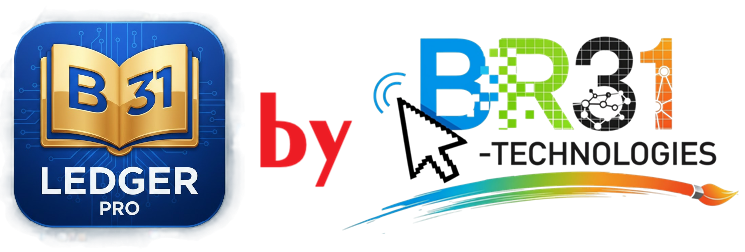

# LedgerPro Desktop Accounting Software



**LedgerPro Desktop** is a comprehensive, professional-grade accounting and inventory management solution designed for small and medium businesses. Built with **Python** and **PySide6**, it offers a robust, secure, and offline-first desktop experience for managing finances, GST billing, stock, and reports.

## 🚀 Key Features

### 📊 Dashboard
- Real-time overview of **Sales**, **Purchases**, and **Receivables**.
- Visual charts for monthly performance tracking.
- Quick access to key metrics like **Total Outstanding** and **Stock Value**.

### 🧾 Invoicing & Billing
- **GST Compliant Invoices**: Create professional B2B and B2C invoices with automatic tax calculations (CGST, SGST, IGST).
- **Customizable Templates**: Professional PDF generation with company branding.
- **Status Tracking**: Track Paid, Unpaid, and Partially Paid invoices.
- **Credit Management**: Handle customer credits and advance payments seamlessly.

### 📦 Inventory Management
- **FIFO Valuation**: Accurate stock valuation using First-In-First-Out methodology.
- **Stock Tracking**: Real-time stock levels with low-stock alerts and reorder points.
- **Product Management**: Support for Goods and Services, HSN/SAC codes, and multiple units.

### 💰 Financial Management
- **Accounts Receivable (AR)**: Track customer outstanding and aging reports.
- **Accounts Payable (AP)**: Manage vendor bills and payment schedules.
- **Payment Recording**: Record payments with partial allocations and excess credit handling.
- **Expense Tracking**: Monitor business expenses and bank charges.

### 📈 Reports & Analytics
- **Comprehensive Reports**: 
  - **Sales & Purchase Registers**
  - **GST Summary** (Input/Output Tax)
  - **Stock Valuation Report**
  - **AR & AP Aging Reports** (30/60/90 days)
  - **Price Lists**
- **Export**: Generate professional PDF reports for all data views.

### 🔒 Security & Data
- **Offline Database**: Secure local SQLite database ensures data privacy.
- **User Authentication**: Built-in login system with session management.
- **Backup & Restore**: Easy tools to backup and restore financial data.

---

## 🛠️ Technology Stack
- **Language**: Python 3.11+
- **GUI Framework**: PySide6 (Qt for Python)
- **Database**: SQLite3
- **Reporting**: ReportLab (PDF Generation)
- **Packaging**: PyInstaller

---

## 📥 Installation & Setup

### Prerequisites
- Python 3.11 or higher installed.
- Git (optional, for cloning).

### Steps
1. **Clone the repository**:
   ```bash
   git clone https://github.com/yourusername/ledgerpro-desktop.git
   cd ledgerpro-desktop
   ```

2. **Create a virtual environment** (Recommended):
   ```bash
   python -m venv venv
   # Windows
   venv\Scripts\activate
   # Linux/Mac
   source venv/bin/activate
   ```

3. **Install dependencies**:
   ```bash
   pip install -r requirements.txt
   ```

4. **Initialize the Database**:
   The application automatically initializes the database on first run. To manually reset or create admin:
   ```bash
   python create_admin.py
   ```

---

## ▶️ Running the Application

To start the application in development mode:
```bash
python main.py
```

---

## 🏗️ Building from Source

To create a standalone executable (`.exe`) for Windows:

1. **Install PyInstaller**:
   ```bash
   pip install pyinstaller
   ```

2. **Build the Executable**:
   Use the included spec file for a configured build:
   ```bash
   pyinstaller LedgerProDesktop.spec
   ```
   
   *Alternatively, use the command line:*
   ```bash
   pyinstaller --noconfirm --onedir --windowed --icon "tsl_icon.ico" --name "LedgerProDesktop" --add-data "assets;assets" --add-data "database/schema.sql;database" main.py
   ```

3. **Locate the Output**:
   The compiled application will be in the `dist/LedgerProDesktop` folder.

---

## 📂 Project Structure

```
d:\TSL-ACCOUNTING_ELEC\
├── assets/             # Icons and images
├── auth/               # Authentication logic & UI
├── database/           # Database connection & schema
├── modules/            # Core business logic (GST, Stock, Invoice)
├── pdf/                # PDF generation engine
├── ui/                 # PySide6 UI screens & widgets
├── reports_pdf/        # Generated PDF reports
├── main.py             # Application entry point
├── LedgerProDesktop.spec # PyInstaller build configuration
└── requirements.txt    # Python dependencies
```

---

## 👨‍💻 Developer & Credits

**LedgerPro Desktop** is developed and maintained by **Angel (Mehul) Singh** of **BR31Technologies**.

- **Client**: The Space Labs
- **Contact**: support@br31tech.live
- **Version**: 2.5.6

---

*© 2026 LedgerPro Desktop. All rights reserved.*
