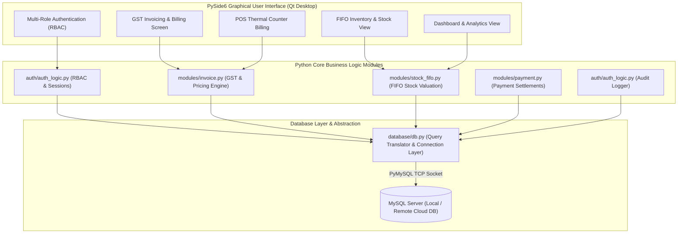
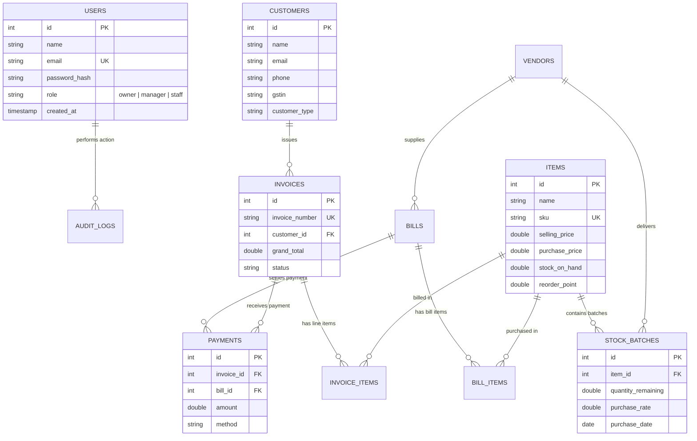
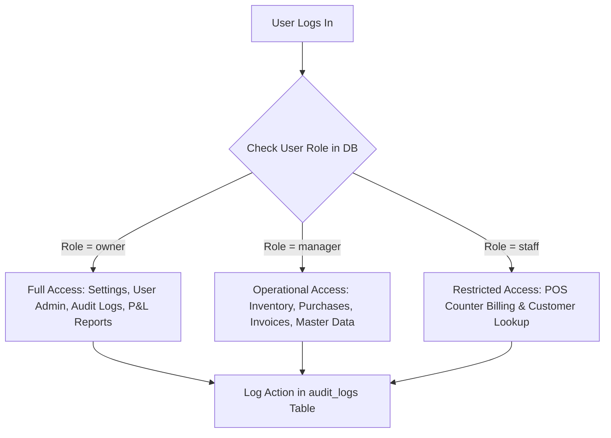

# LedgerPro Desktop - Enterprise Accounting & Inventory Management


**LedgerPro Desktop** is a high-performance, enterprise-grade accounting, billing, and inventory management desktop application built specifically for small to medium-sized businesses. Powered by **Python (PySide6)** and backed by a robust **MySQL Database Engine**, LedgerPro delivers multi-user networking, real-time stock FIFO tracking, GST-compliant invoicing, audit logging, and thermal POS receipt printing.

---

## 🏗️ System Architecture & Data Flow

LedgerPro utilizes a modular architecture designed for high throughput, data integrity, and low-latency database queries across multi-user local networks or cloud MySQL servers.


```mermaid
graph TD
    subgraph UI Layer ["PySide6 Graphical User Interface (Qt Desktop)"]
        UI_Dash["Dashboard & Analytics View"]
        UI_Inv["GST Invoicing & Billing Screen"]
        UI_Stock["FIFO Inventory & Stock View"]
        UI_POS["POS Thermal Counter Billing"]
        UI_Auth["Multi-Role Authentication (RBAC)"]
    end

    subgraph Business Logic ["Python Core Business Logic Modules"]
        M_Auth["auth/auth_logic.py (RBAC & Sessions)"]
        M_Inv["modules/invoice.py (GST & Pricing Engine)"]
        M_FIFO["modules/stock_fifo.py (FIFO Stock Valuation)"]
        M_Pay["modules/payment.py (Payment Settlements)"]
        M_Audit["auth/auth_logic.py (Audit Logger)"]
    end

    subgraph DB Engine ["Database Layer & Abstraction"]
        DB_Adapter["database/db.py (Query Translator & Connection Layer)"]
        DB_MySQL[("MySQL Server (Local / Remote Cloud DB)")]
    end

    UI_Auth --> M_Auth
    UI_Inv --> M_Inv
    UI_Stock --> M_FIFO
    UI_POS --> M_Inv
    UI_Dash --> M_FIFO

    M_Auth --> DB_Adapter
    M_Inv --> DB_Adapter
    M_FIFO --> DB_Adapter
    M_Pay --> DB_Adapter
    M_Audit --> DB_Adapter

    DB_Adapter -->|"PyMySQL TCP Socket"| DB_MySQL
```

---

## 📊 Database Entity Relationship Diagram

LedgerPro operates on a relational schema engineered for relational integrity, multi-user concurrency, and audit traceability in MySQL:


```mermaid
erDiagram
    USERS ||--o{ AUDIT_LOGS : "performs action"
    CUSTOMERS ||--o{ INVOICES : "issues"
    VENDORS ||--o{ BILLS : "supplies"
    VENDORS ||--o{ STOCK_BATCHES : "delivers"
    ITEMS ||--o{ STOCK_BATCHES : "contains batches"
    ITEMS ||--o{ INVOICE_ITEMS : "billed in"
    ITEMS ||--o{ BILL_ITEMS : "purchased in"
    INVOICES ||--o{ INVOICE_ITEMS : "has line items"
    BILLS ||--o{ BILL_ITEMS : "has bill items"
    INVOICES ||--o{ PAYMENTS : "receives payment"
    BILLS ||--o{ PAYMENTS : "settles payment"

    USERS {
        int id PK
        string name
        string email UK
        string password_hash
        string role "owner | manager | staff"
        timestamp created_at
    }

    CUSTOMERS {
        int id PK
        string name
        string email
        string phone
        string gstin
        string customer_type
    }

    ITEMS {
        int id PK
        string name
        string sku UK
        double selling_price
        double purchase_price
        double stock_on_hand
        double reorder_point
    }

    STOCK_BATCHES {
        int id PK
        int item_id FK
        double quantity_remaining
        double purchase_rate
        date purchase_date
    }

    INVOICES {
        int id PK
        string invoice_number UK
        int customer_id FK
        double grand_total
        string status
    }

    PAYMENTS {
        int id PK
        int invoice_id FK
        int bill_id FK
        double amount
        string method
    }
```

---

## 🚀 Key Features

### 📊 Real-Time Dashboard & Analytics
- Live tracking of **Sales Revenue**, **Purchase Expenses**, **Accounts Receivable (AR)**, and **Accounts Payable (AP)**.
- High-level KPIs and automated inventory alert badges for items reaching reorder thresholds.

### 🧾 GST-Compliant Invoicing & Thermal POS
- **Multi-Tier Customer Pricing**: Automatic selection of selling prices (`Selling Price`, `SP1`, `SP2`, `SP3`) based on Customer Type.
- **GST Tax Engine**: Auto calculation of CGST, SGST, IGST, HSN/SAC summaries, discount percentages, and round-offs.
- **Thermal Receipt Printer Support**: Instant ESC/POS printing for 80mm (3-inch) and 58mm (2-inch) POS thermal receipts.
- **UPI QR Code Payments**: Generate dynamic UPI payment QR codes directly on invoices for instant scan-and-pay via GPay, PhonePe, or Paytm.

### 📦 FIFO Inventory Valuation
- **First-In-First-Out (FIFO) Engine**: Tracks exact purchase batches (`stock_batches`) to calculate true Cost of Goods Sold (COGS) and accurate profit margins.
- **Bulk CSV Import**: High-speed catalog item import with automated column header matching.

### 🔐 Multi-User Security & Audit Trail
- **Role-Based Access Control (RBAC)**: Enforces access policies across 3 distinct roles:
  - **Owner**: Full access to all business metrics, financial reports, user administration, and audit logs.
  - **Manager**: Access to inventory adjustments, vendor bills, customer management, and invoice creation.
  - **Staff**: Counter billing, quick POS invoice creation, and customer lookups.
- **Audit Logs Table**: Full traceability logging user ID, user name, module, action (`CREATE`, `UPDATE`, `DELETE`), and timestamp.

---

## 🔐 Multi-Role Authorization Workflow


```mermaid
graph TD
    UserLogin["User Logs In"] --> CheckRole{"Check User Role in DB"}
    
    CheckRole -->|"Role = owner"| OwnerView["Full Access: Settings, User Admin, Audit Logs, P&L Reports"]
    CheckRole -->|"Role = manager"| ManagerView["Operational Access: Inventory, Purchases, Invoices, Master Data"]
    CheckRole -->|"Role = staff"| StaffView["Restricted Access: POS Counter Billing & Customer Lookup"]

    OwnerView --> LogAction["Log Action in audit_logs Table"]
    ManagerView --> LogAction
    StaffView --> LogAction
```

---

## 🛠️ Technology Stack

| Component | Technology / Library | Purpose |
|---|---|---|
| **Core Runtime** | Python 3.11+ | Business logic execution engine |
| **GUI Framework** | PySide6 (Qt6 for Python) | Desktop UI rendering & event loop |
| **Database Engine** | **MySQL 8.0+** / MariaDB | Enterprise relational database backend |
| **DB Connector** | PyMySQL | Pure-Python MySQL driver with parameterized query security |
| **PDF Generation** | ReportLab | High-resolution PDF invoice and report rendering |
| **Thermal POS** | python-escpos / Win32 RAW | ESC/POS binary command formatting for 80mm/58mm printers |
| **Executable Packager**| PyInstaller | Standalone single-directory Windows `.exe` packaging |

---

## 📥 Installation & Setup (MySQL Backend)

### Prerequisites
1. Installed **Python 3.11+**.
2. A running **MySQL Server** (Localhost or Cloud MySQL host like AWS RDS, Hostinger, DigitalOcean).

### 1. Clone & Install Dependencies
```bash
git clone https://github.com/yourusername/ledgerpro-desktop.git
cd ledgerpro-desktop

# Create virtual environment
python -m venv venv
venv\Scripts\activate

# Install Python requirements
pip install -r requirements.txt
```

### 2. Configure MySQL Database
Run the interactive setup helper:
```bash
python mysql_setup.py
```
Or manually set up `config.json` in the root folder:
```json
{
  "database": {
    "type": "mysql",
    "host": "localhost",
    "port": 3306,
    "user": "root",
    "password": "your_mysql_password",
    "database": "ledgerpro"
  }
}
```

### 3. Initialize Admin & Database Schemas
Run the schema setup script or create the primary administrator:
```bash
python create_admin.py
```

### 4. Run Application
```bash
python main.py
```

---

## 🏗️ Building Standalone Executable (`.exe`)

To compile LedgerPro into a standalone Windows executable:

```bash
pyinstaller LedgerProDesktop.spec
```
The output executable package will be created under `dist/LedgerProDesktop/`.

---

## 👨‍💻 Developer & Credits

- **Developer**: Mehul (Angel) Singh (BR31Technologies)
- **Client**: The Space Labs
- **Contact**: support@br31tech.live
- **Version**: 3.5.0 Enterprise (MySQL Edition)

*© 2026 LedgerPro Desktop. All rights reserved.*
