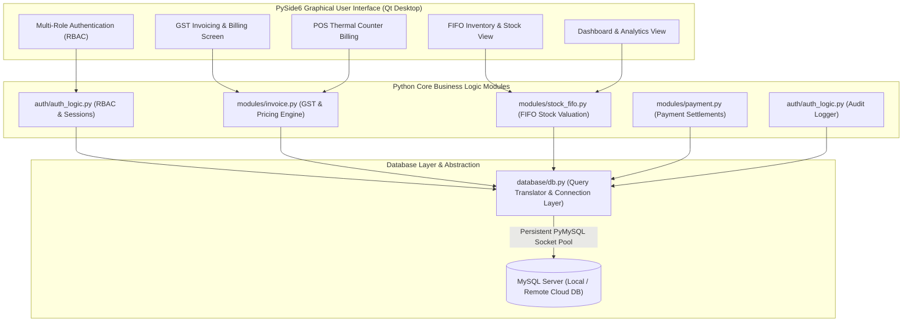
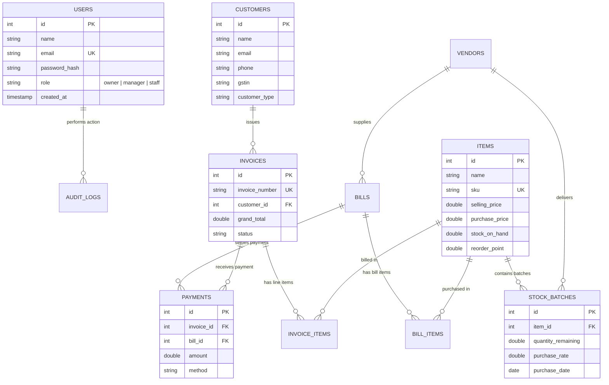
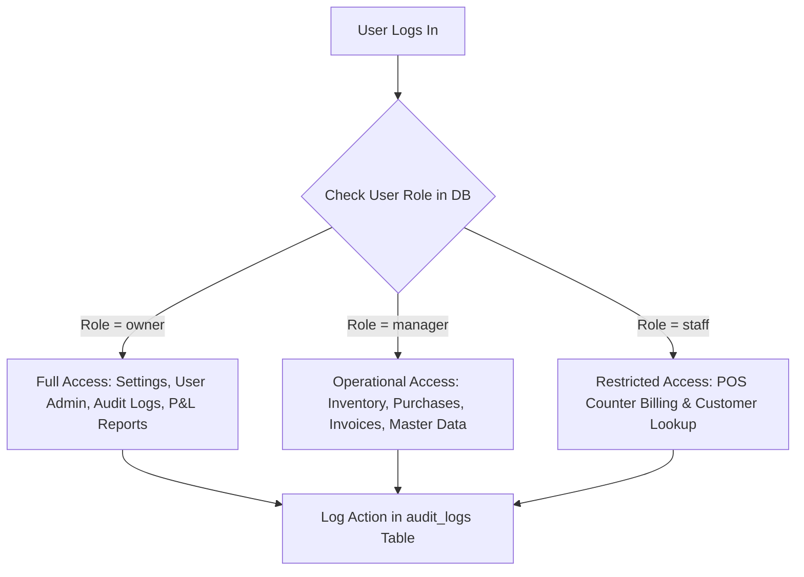
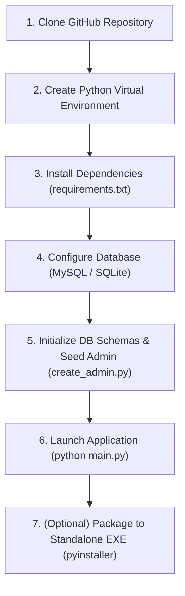
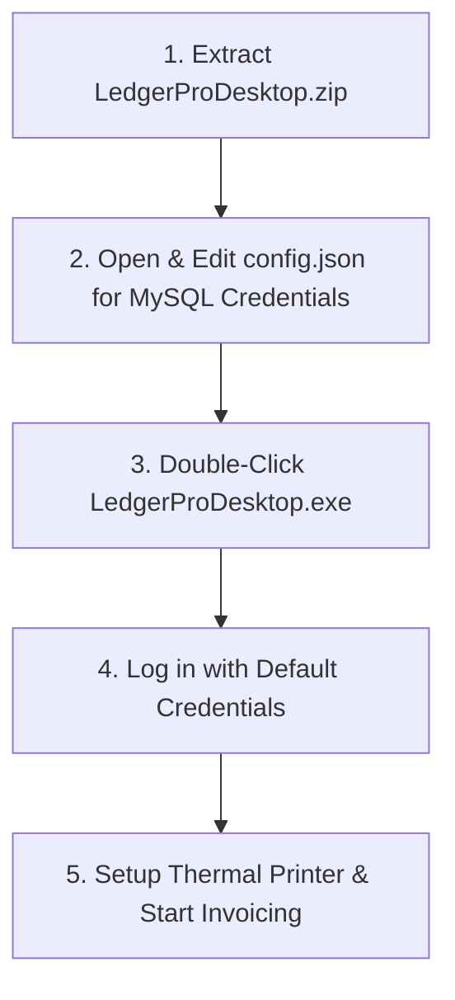

# LedgerPro Desktop - Enterprise Accounting & Inventory Management


**LedgerPro Desktop** is a high-performance, enterprise-grade accounting, billing, and inventory management desktop application built specifically for small to medium-sized businesses. Powered by **Python (PySide6)** and backed by a robust **MySQL Database Engine**, LedgerPro delivers multi-user networking, real-time stock FIFO tracking, GST-compliant invoicing, audit logging, and thermal POS receipt printing.

---

## 🏗️ System Architecture & Data Flow

LedgerPro utilizes a modular architecture designed for high throughput, data integrity, and low-latency database queries across multi-user local networks or cloud MySQL servers.


```mermaid
graph TD
    subgraph UI Layer ["PySide6 Graphical User Interface (Qt Desktop)"]
        UI_Dash["Dashboard & Analytics View"]
        UI_Inv["GST Invoicing & Billing Screen"]
        UI_Stock["FIFO Inventory & Stock View"]
        UI_POS["POS Thermal Counter Billing"]
        UI_Auth["Multi-Role Authentication (RBAC)"]
    end

    subgraph Business Logic ["Python Core Business Logic Modules"]
        M_Auth["auth/auth_logic.py (RBAC & Sessions)"]
        M_Inv["modules/invoice.py (GST & Pricing Engine)"]
        M_FIFO["modules/stock_fifo.py (FIFO Stock Valuation)"]
        M_Pay["modules/payment.py (Payment Settlements)"]
        M_Audit["auth/auth_logic.py (Audit Logger)"]
    end

    subgraph DB Engine ["Database Layer & Abstraction"]
        DB_Adapter["database/db.py (Query Translator & Connection Layer)"]
        DB_MySQL[("MySQL Server (Local / Remote Cloud DB)")]
    end

    UI_Auth --> M_Auth
    UI_Inv --> M_Inv
    UI_Stock --> M_FIFO
    UI_POS --> M_Inv
    UI_Dash --> M_FIFO

    M_Auth --> DB_Adapter
    M_Inv --> DB_Adapter
    M_FIFO --> DB_Adapter
    M_Pay --> DB_Adapter
    M_Audit --> DB_Adapter

    DB_Adapter -->|"Persistent PyMySQL Socket Pool"| DB_MySQL
```

---

## ⚡ High-Performance Database Engine & Optimizations

LedgerPro is engineered for instantaneous database query performance and UI responsiveness on both local SQLite and remote/networked MySQL servers:

1. **Persistent Thread-Local Connection Caching**: Eliminates TCP socket re-connection handshake latency (15–50ms saved per query) by caching and pinging active thread connections (`conn.ping(reconnect=True)`).
2. **Single-Query Stock FIFO Aggregation**: `get_stock_valuation_summary()` executes 1 aggregated `LEFT JOIN` query with `GROUP BY`, replacing $N+1$ query loops for instant inventory valuation loading.
3. **Targeted B-Tree Database Indexes (Migration v8)**: Key tables (`stock_batches`, `items`, `invoices`, `bills`, `invoice_items`, `bill_items`, `payments`) are indexed on foreign keys, SKU, item name, status, and dates to ensure instant lookup speeds.
4. **UI Table Repaint Throttling**: Batch table rendering disables GUI updates during data population (`setUpdatesEnabled(False)`), preventing repaints and layout freezes.

---

## 📊 Database Entity Relationship Diagram

LedgerPro operates on a relational schema engineered for relational integrity, multi-user concurrency, and audit traceability in MySQL:


```mermaid
erDiagram
    USERS ||--o{ AUDIT_LOGS : "performs action"
    CUSTOMERS ||--o{ INVOICES : "issues"
    VENDORS ||--o{ BILLS : "supplies"
    VENDORS ||--o{ STOCK_BATCHES : "delivers"
    ITEMS ||--o{ STOCK_BATCHES : "contains batches"
    ITEMS ||--o{ INVOICE_ITEMS : "billed in"
    ITEMS ||--o{ BILL_ITEMS : "purchased in"
    INVOICES ||--o{ INVOICE_ITEMS : "has line items"
    BILLS ||--o{ BILL_ITEMS : "has bill items"
    INVOICES ||--o{ PAYMENTS : "receives payment"
    BILLS ||--o{ PAYMENTS : "settles payment"

    USERS {
        int id PK
        string name
        string email UK
        string password_hash
        string role "owner | manager | staff"
        timestamp created_at
    }

    CUSTOMERS {
        int id PK
        string name
        string email
        string phone
        string gstin
        string customer_type
    }

    ITEMS {
        int id PK
        string name
        string sku UK
        double selling_price
        double purchase_price
        double stock_on_hand
        double reorder_point
    }

    STOCK_BATCHES {
        int id PK
        int item_id FK
        double quantity_remaining
        double purchase_rate
        date purchase_date
    }

    INVOICES {
        int id PK
        string invoice_number UK
        int customer_id FK
        double grand_total
        string status
    }

    PAYMENTS {
        int id PK
        int invoice_id FK
        int bill_id FK
        double amount
        string method
    }
```

---

## 🚀 Key Features

### 📊 Real-Time Dashboard & Analytics
- Live tracking of **Sales Revenue**, **Purchase Expenses**, **Accounts Receivable (AR)**, and **Accounts Payable (AP)**.
- High-level KPIs and automated inventory alert badges for items reaching reorder thresholds.

### 🧾 GST-Compliant Invoicing & Thermal POS
- **Multi-Tier Customer Pricing**: Automatic selection of selling prices (`Selling Price`, `SP1`, `SP2`, `SP3`) based on Customer Type.
- **GST Tax Engine**: Auto calculation of CGST, SGST, IGST, HSN/SAC summaries, discount percentages, and round-offs.
- **Thermal Receipt Printer Support**: Instant ESC/POS printing for 80mm (3-inch) and 58mm (2-inch) POS thermal receipts.
- **UPI QR Code Payments**: Generate dynamic UPI payment QR codes directly on invoices for instant scan-and-pay via GPay, PhonePe, or Paytm.

### 📦 FIFO Inventory Valuation
- **First-In-First-Out (FIFO) Engine**: Tracks exact purchase batches (`stock_batches`) to calculate true Cost of Goods Sold (COGS) and accurate profit margins.
- **Bulk CSV Import**: High-speed catalog item import with automated column header matching.

### 🔐 Multi-User Security & Audit Trail
- **Role-Based Access Control (RBAC)**: Enforces access policies across 3 distinct roles:
  - **Owner**: Full access to all business metrics, financial reports, user administration, and audit logs.
  - **Manager**: Access to inventory adjustments, vendor bills, customer management, and invoice creation.
  - **Staff**: Counter billing, quick POS invoice creation, and customer lookups.
- **Audit Logs Table**: Full traceability logging user ID, user name, module, action (`CREATE`, `UPDATE`, `DELETE`), and timestamp.

---

## 🔐 Multi-Role Authorization Workflow


```mermaid
graph TD
    UserLogin["User Logs In"] --> CheckRole{"Check User Role in DB"}
    
    CheckRole -->|"Role = owner"| OwnerView["Full Access: Settings, User Admin, Audit Logs, P&L Reports"]
    CheckRole -->|"Role = manager"| ManagerView["Operational Access: Inventory, Purchases, Invoices, Master Data"]
    CheckRole -->|"Role = staff"| StaffView["Restricted Access: POS Counter Billing & Customer Lookup"]

    OwnerView --> LogAction["Log Action in audit_logs Table"]
    ManagerView --> LogAction
    StaffView --> LogAction
```

---

## 🛠️ Technology Stack

| Component | Technology / Library | Purpose |
|---|---|---|
| **Core Runtime** | Python 3.11+ | Business logic execution engine |
| **GUI Framework** | PySide6 (Qt6 for Python) | Desktop UI rendering & event loop |
| **Database Engine** | **MySQL 8.0+** / MariaDB | Enterprise relational database backend |
| **DB Connector** | PyMySQL | Pure-Python MySQL driver with parameterized query security |
| **PDF Generation** | ReportLab | High-resolution PDF invoice and report rendering |
| **Thermal POS** | python-escpos / Win32 RAW | ESC/POS binary command formatting for 80mm/58mm printers |
| **Executable Packager**| PyInstaller | Standalone single-directory Windows `.exe` packaging |

---

## 🚀 Comprehensive Step-by-Step Setup & Installation Guide

LedgerPro Desktop can be installed and run either from the **GitHub Source Code Repository** (for developers / custom setups) or using the **Standalone Application Package (.exe)** (for clients & end-users).

---

### 📦 Option A: Setup from GitHub Source Code Repository

Use this guide if you cloned or downloaded the source code repository from GitHub.


```mermaid
graph TD
    A1["1. Clone GitHub Repository"] --> A2["2. Create Python Virtual Environment"]
    A2 --> A3["3. Install Dependencies (requirements.txt)"]
    A3 --> A4["4. Configure Database (MySQL / SQLite)"]
    A4 --> A5["5. Initialize DB Schemas & Seed Admin (create_admin.py)"]
    A5 --> A6["6. Launch Application (python main.py)"]
    A6 --> A7["7. (Optional) Package to Standalone EXE (pyinstaller)"]
```

#### Step 1: Clone the Repository
Open PowerShell or Command Prompt and run:
```bash
git clone https://github.com/angel7544/TSL-LedgerPro.git
cd TSL-LedgerPro
```

#### Step 2: Create & Activate Virtual Environment
```bash
# Create virtual environment
python -m venv venv

# Activate on Windows PowerShell:
.\venv\Scripts\Activate.ps1

# Activate on Windows Command Prompt (cmd):
venv\Scripts\activate
```

#### Step 3: Install Required Dependencies
```bash
pip install -r requirements.txt
```

#### Step 4: Configure Database Backend (`config.json`)

- **For MySQL Backend (Recommended for Multi-User Networking):**
  Run the interactive setup helper:
  ```bash
  python mysql_setup.py
  ```
  Or edit `config.json` directly in the project root:
  ```json
  {
    "database": {
      "type": "mysql",
      "host": "localhost",
      "port": 3306,
      "user": "root",
      "password": "YOUR_MYSQL_PASSWORD",
      "database": "ledgerpro"
    }
  }
  ```

- **For SQLite Backend (Single-Machine Mode):**
  Set `type` to `"sqlite"` in `config.json`:
  ```json
  {
    "database": {
      "type": "sqlite"
    }
  }
  ```

#### Step 5: Initialize Database Schemas & Create Administrator
Run the admin initialization script. This will create database tables, apply all schema migrations (v1 to v8 with performance indexes), and seed default credentials:
```bash
python create_admin.py
```

#### Step 6: Launch Application
```bash
python main.py
```

#### Step 7: (Optional) Build Standalone `.exe` Package
To bundle the Python project into a single-folder standalone Windows executable:
```bash
pyinstaller LedgerProDesktop.spec
```
The compiled application output will be created at `dist/LedgerProDesktop/`.

---

### 💻 Option B: Setup from Standalone Application Package (`.exe` / ZIP)

Use this guide if you received a pre-built application folder or `.zip` release package.


```mermaid
graph TD
    B1["1. Extract LedgerProDesktop.zip"] --> B2["2. Open & Edit config.json for MySQL Credentials"]
    B2 --> B3["3. Double-Click LedgerProDesktop.exe"]
    B3 --> B4["4. Log in with Default Credentials"]
    B4 --> B5["5. Setup Thermal Printer & Start Invoicing"]
```

#### Step 1: Extract the Package
Unzip `LedgerProDesktop.zip` into your preferred directory (e.g., `C:\LedgerProDesktop`).

#### Step 2: Configure Database Server Connection
Open `config.json` inside the extracted folder using Notepad:
```json
{
  "database": {
    "type": "mysql",
    "host": "192.168.1.100",
    "port": 3306,
    "user": "root",
    "password": "YOUR_MYSQL_PASSWORD",
    "database": "ledgerpro"
  }
}
```
*(Replace `192.168.1.100` with `localhost` for local installation, or your central MySQL server's IP address for multi-user office networks).*

#### Step 3: Run the Application
Double-click **`LedgerProDesktop.exe`**.
*(Tip: Right-click `LedgerProDesktop.exe` and select **Send to > Desktop (create shortcut)** for quick access).*

#### Step 4: Log In using Pre-Configured Credentials

| Role | Email Address | Password | Access Rights |
|---|---|---|---|
| **Owner / Admin** | `admin@br31tech.live` | `admin123` | Full Access (User Mgmt, Settings, Audit Logs, Reports) |
| **Store Manager** | `manager@br31tech.live` | `admin123` | Master Data, Purchase Bills, FIFO Stock Adjustments |
| **Billing Staff** | `staff@br31tech.live` | `admin123` | Quick Counter Billing & Thermal POS Print |

*(Note: The primary Owner can create additional staff and manager user accounts from **User Management**).*

---

## 👨‍💻 Developer & Credits

- **Developer**: Mehul (Angel) Singh (BR31Technologies)
- **Client**: The Space Labs
- **Contact**: support@br31tech.live
- **Version**: 3.5.0 Enterprise (MySQL Edition)

*© 2026 LedgerPro Desktop. All rights reserved.*

