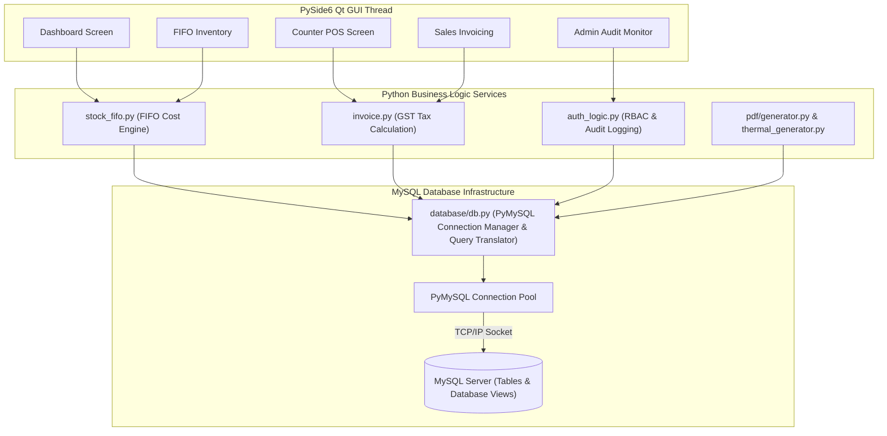
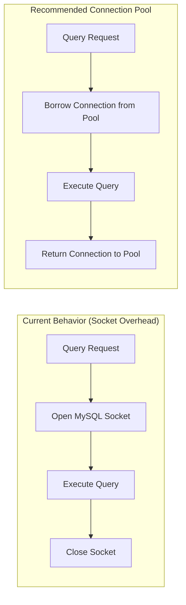
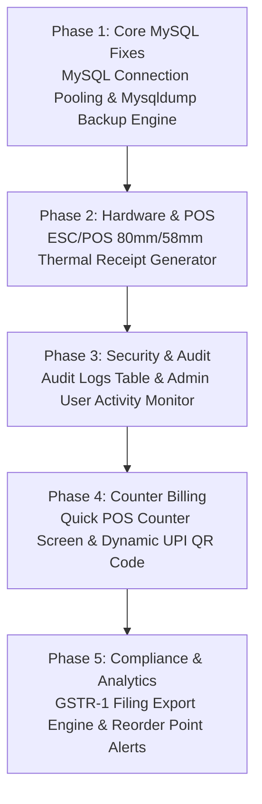

# LedgerPro Desktop - Codebase Architecture, System Improvements & Technical Roadmap (MySQL Edition)

This document presents an engineering evaluation, architectural roadmap, and technical improvement specification for **LedgerPro Desktop Application** built with **Python (PySide6)** and backed by an enterprise **MySQL Database Engine**.

---

## 🏗️ System Architecture & Data Pipeline (MySQL Engine)

LedgerPro is structured into a clean multi-layer desktop architecture. The PySide6 Qt GUI communicates with pure-Python business logic services, which query the central **MySQL Database** via PyMySQL.

---

## 1. Technical Audit & Code Health Improvements (MySQL Focus)

### 1. Database Connection Pooling for MySQL
- **Current Observation**: `get_connection()` in `database/db.py` creates a new `pymysql.connect(...)` socket connection on every query call and closes it in a `finally:` block.
- **Performance Impact**: Repeated TCP socket initialization on high-frequency transactions introduces latency, particularly over network connections.
- **Architectural Solution**: Implement connection pooling using `dbutils.pooled_db` or a thread-safe connection wrapper to reuse active MySQL connections.

---

### 2. Main Thread UI Responsive Execution
- **Current Observation**: Heavy queries (such as annual GST summaries or ReportLab multi-page PDF rendering) run on the main Qt GUI thread.
- **Solution**: Execute PDF generation and heavy report queries inside `QThread` / `QRunnable` worker pools to keep the PySide6 UI smooth and responsive.

---

### 3. Automated MySQL Database Backup Engine
- **Current Observation**: Legacy backup function performed local file copy of SQLite databases.
- **Solution**: Update `ui/settings.py` backup routine to execute `mysqldump` commands or export serialized JSON database snapshots when connected to MySQL.

---

### 4. Audit Trail & Staff Activity Tracking (`audit_logs`)
- **Current Structure**: System actions (creating invoices, editing stock levels, deleting records, logging in) are executed without user attribution.
- **Solution**: Enforce automated logging via `log_audit_action()` into the `audit_logs` MySQL table:
  - Fields: `id`, `user_id`, `user_name`, `action`, `module`, `record_id`, `details`, `timestamp`.

---

## 2. Feature Improvements for Staff & POS Billing

### 1. Dedicated POS / Counter Billing Screen
- Barcode scanner input field for fast item lookups (`F2` shortcut).
- Instant cash tendered vs change due calculator.
- One-click **Thermal POS Receipt Printing**.

### 2. ESC/POS Thermal Receipt Printer Pipeline (80mm / 58mm)

---

### 3. Dynamic UPI Payment QR Code Generation
- Embed dynamic UPI QR code (`upi://pay?pa=YOUR_UPI_ID&pn=COMPANY_NAME&am=AMOUNT`) on invoices and POS receipts using `qrcode` and `ReportLab`. Customers scan via Google Pay, PhonePe, Paytm, or BHIM.

---

## 3. Feature Improvements for Managers & Administrators

### 1. Audit Trail & Activity Monitor (Admin View)
- Filterable activity table showing user actions (`INSERT`, `UPDATE`, `DELETE`), module, date ranges, and record IDs.

### 2. Customer Credit Limit Control
- Set authorized credit limits per customer profile. Warn or block invoice creation if customer balance exceeds authorized credit limits.

### 3. GSTR-1 & GSTR-3B Filing Export Engine
- Export B2B, B2C, HSN summary, and input tax tables in Excel/JSON format for portal GST filing.

---

## 4. Implementation Action Plan Roadmap

| Phase | Milestone | Deliverable | Priority |
|---|---|---|---|
| **Phase 1** | Core Infrastructure | MySQL Connection Pooling & `mysqldump` Backup Integration | **High** |
| **Phase 2** | POS Hardware | ESC/POS 80mm / 58mm Thermal Printer Engine & Setup UI | **High** |
| **Phase 3** | Security & Audit | `audit_logs` MySQL Table & Admin Monitoring Screen | **High** |
| **Phase 4** | Counter POS | High-Speed POS Screen & Dynamic UPI QR Code Generation | **Medium** |
| **Phase 5** | GST Compliance | GSTR-1 Excel/JSON Export Engine & Stock Reorder Alerts | **Medium** |
